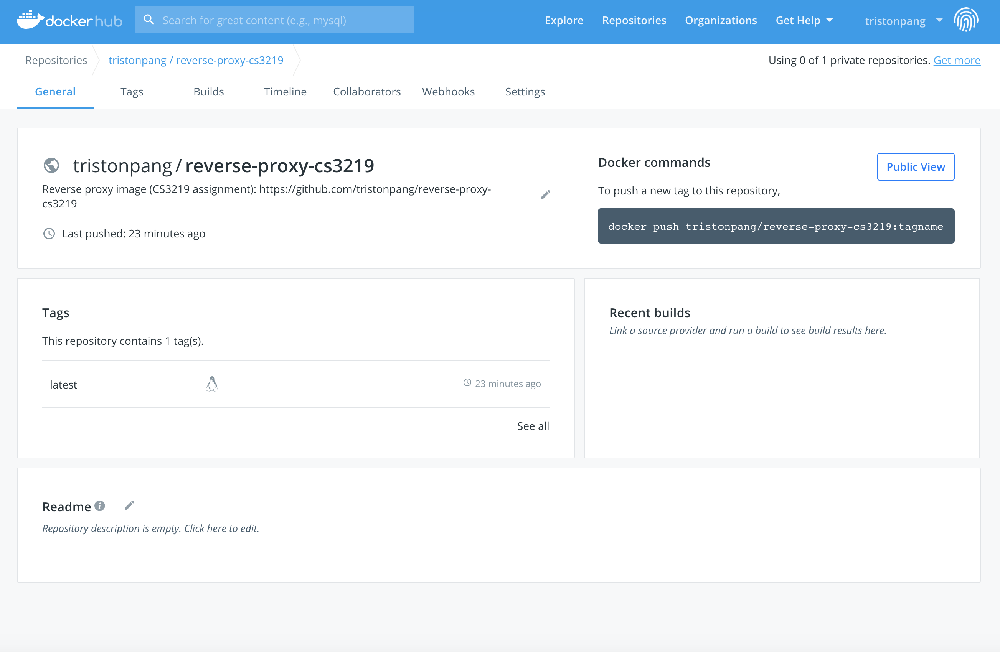
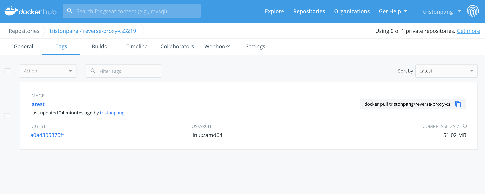

# CS3219 OTOT Assignment Task A
## Name: Triston Pang Erh Syen

## How to run the Docker container
1. Fork and pull the repository into your local machine
2. Navigate to the repository directory via Terminal/Bash
3. Run the command `docker build -t webserver .` to build the image
4. Run the command `docker run -it --rm -d -p 8080:80 --name web webserver` to start the container (Docker container internal port 80 exposed to local machine's port 8080)
5. Using a web browser, go to `localhost:8080`. You should see the main page of the mock website.

## Demonstrating a reverse proxy
The Nginx webserver is designed to perform a reverse proxy on requests ending with `/do-prox`, redirecting you to a HTML page that is located at `/redirect/reverse-proxy.html`. Instructions are provided on the main page of the mock website but will be provided here as well
1. Add `/do-prox` to the end of the current URL of the main page, i.e. `localhost:8080/do-prox`
2. The Nginx webserver wil perform a reverse proxy, redirecting you to the page located at `localhost:8080/redirect/reverse-proxy.html`

## Docker Hub image
The image has also been pushed to my Docker Hub repository. You can access it here: https://hub.docker.com/repository/docker/tristonpang/reverse-proxy-cs3219

